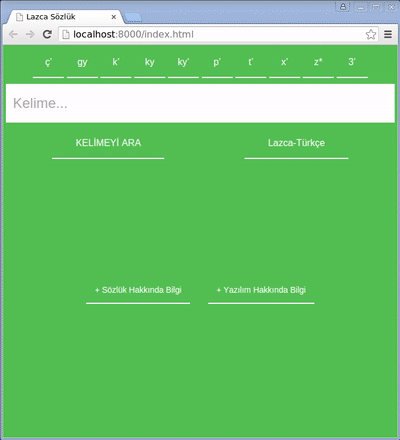

# Lazca Sözlük
Çoklu platformda çalışan Lazca-Türkçe ve Türkçe-Lazca sözlük.

Bu ugulamadaki amacım http://ayla7.free.fr/laz/ adresindeki verileri kullanarak daha kolay erişebilir sözlük oluşturmaktır.

Projenin şu anki çalışan hali:

### Kaynak koddan çalıştırma
Çalımasi için Cordova CLI ile derlenmesi gereklidir.
Ayrıca cordova/www/data klasöründe [sözlük verilerinin](https://github.com/aytacyildiz/lazcasozlukfetcher)
bulunması gereklidir.
